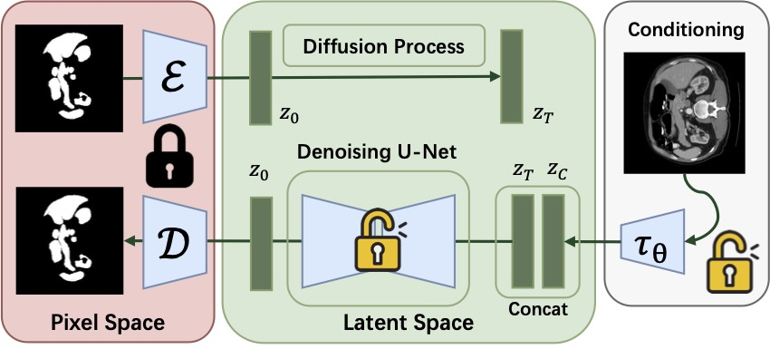

# Stable Diffusion Segmentation (SDSeg)
This is the repo of **Stable Diffusion Segmentation for Biomedical Images with Single-step Reverse Process**. [](https://github.com/lin-tianyu/Stable-Diffusion-Seg/)


By Tianyu Lin , Zhiguang Chen, Zhonghao Yan, Fudan Zheng and Weijiang Yu.

## News
- 06/17: **SDSeg** has been accepted by MICCAI2024! 🎉🥳 Our paper will be available soon.

## SDSeg Framework


SDSeg is built on Stable Diffusion (V1), with a downsampling-factor 8 autoencoder, a denoising UNet, and trainable vision encoder (with the same architecture of the encoder in the f=8 autoencoder).


## Requirements

A suitable [conda](https://conda.io/) environment named `sdseg` can be created
and activated with:

```bash
conda env create -f environment.yaml
conda activate sdseg
```

Then, install some dependencies by:
```bash
pip install -e git+https://github.com/CompVis/taming-transformers.git@master#egg=taming-transformers
pip install -e git+https://github.com/openai/CLIP.git@main#egg=clip
pip install -e .
```

    
<details>

<summary>Solve GitHub connection issues when downloading <code class="inlinecode">taming-transformers</code> or <code class="inlinecode">clip</code></summary>

---

After creating and entering the `sdseg` environment:
1. create an `src` folder and enter:
```bash
mkdir src
cd src
```
2. download the following codebases in `*.zip` files and upload to `src/`:
    - https://github.com/CompVis/taming-transformers, `taming-transformers-master.zip`
    - https://github.com/openai/CLIP, `CLIP-main.zip`
3. unzip and install taming-transformers:
```bash
unzip taming-transformers-master.zip
cd taming-transformers-master
pip install -e .
cd ..
```
4. unzip and install clip:
```bash
unzip CLIP-main.zip
cd CLIP-main
pip install -e .
cd ..
```
5. install latent-diffusion:
```bash
cd ..
pip install -e .
```

Then you're good to go!

---
</details>


## Dataset Settings

The image data should be place at `./data/`, while the dataloaders are at `./ldm/data/`

We evaluate SDSeg on the following medical image datasets:

1. `BTCV`
    - URL: https://www.synapse.org/#!Synapse:syn3193805/wiki/217752, download the `Abdomen/RawData.zip`.
    - Preprocess: use the code in `./data/synapse/nii2format.py`

2. `STS-3D`:
    - URL: https://toothfairychallenges.github.io/, download `labelled.zip`.
    - Preprocess: use the code in `./data/sts3d/sts3d_preprocess.py`

3. `REFUGE2`:
    - URL: https://refuge.grand-challenge.org/
    - Preprocess: following https://github.com/HzFu/MNet_DeepCDR

4. `CVC-ClinicDB`:
    - URL: https://www.kaggle.com/datasets/balraj98/cvcclinicdb
    - Preprocess: None

5. `Kvasir-SEG`:
    - URL: https://datasets.simula.no/kvasir-seg/
    - Preprocess: None


## Model Weights

### Pretrained Models
SDSeg uses pre-trained weights from SD to initialize before training.

For pre-trained weights of the autoencoder and conditioning model, run

```bash
bash scripts/download_first_stages_f8.sh
```

For pre-trained wights of the denoising UNet, run

```bash
bash scripts/download_models_lsun_churches.sh
```

### Trained SDSeg Models
> The model weights trained on medical image datasets will be available soon.

## Scripts
### Training Scripts

Take CVC dataset as an example, run

```bash
nohup python -u main.py --base configs/latent-diffusion/cvc-ldm-kl-8.yaml -t --gpus 0, --name experiment_name > nohup/experiment_name.log 2>&1 &
```

You can check the training log by 

```bash
tail -f nohup/experiment_name.log
```

Also, tensorboard will be on automatically. You can start a tensorboard session with `--logdir=./logs/`

> STORAGE WARNING: A single SDSeg model ckeckpoint is around 5GB. By default, save only the last model and the model with the highest dice score. If you have tons of storage space, feel free to save more models by increasing the `save_top_k` parameter in `main.py`.


### Testing Scripts

After training an SDSeg model, you should **manually modify the run paths** in `scripts/slice2seg.py`, and begin an inference process like

```bash
python -u scripts/slice2seg.py --dataset cvc
```


### Stability Evaluaition

To conduct an stability evaluation process mentioned in the paper, you can start the test by

```bash
python -u scripts/slice2seg.py --dataset cvc --times 10 --save_results
```

This will save 10 times of inference results in `./outputs/` folder. To run the stability evaluation, open `scripts/stability_evaluation.ipynb`, and **modify the path for the segmentation results**. Then, click `Run All` and enjoy.


## Important Files and Folders to Focus on
Training related:
- SDSeg model: `./ldm/models/diffusion/ddpm.py` in the class `LatentDiffusion`.
- Experiment Configurations: `./configs/latent-diffusion`

Inference related:
- Inference starting scripts: `./scripts/slice2seg.py`, 
- Inference implementation: `./ldm/models/diffusion/ddpm.py`, under the `log_dice` method of `LatentDiffusion`.

Dataset related:
- Dataset storation: `./data/`
- Dataloader files: `./ldm/data/`

## Citation
If you find our work useful, please cite:
```biblabtex
@inproceedings{lin2024stable,
  title={Stable Diffusion Segmentation for Biomedical Images with Single-step Reverse Process},
  author={Lin, Tianyu and Chen, Zhiguang and Yan, Zhonghao and Zheng, Fudan and Yu, Weijiang},
  journal={International Conference on Medical Image Computing and Computer-Assisted Intervention},
  year={2024},
  organization={Springer}
}
```


## TODO List

- [ ] Organizing the inference code. (Toooo redundant right now.)
- [ ] Reimplement SDSeg in OOP. (Elegance is the key!)
- [ ] Add README for multi-class segmentation.
- [ ] Release model weights.
- [ ] Reimplement using diffusers.


